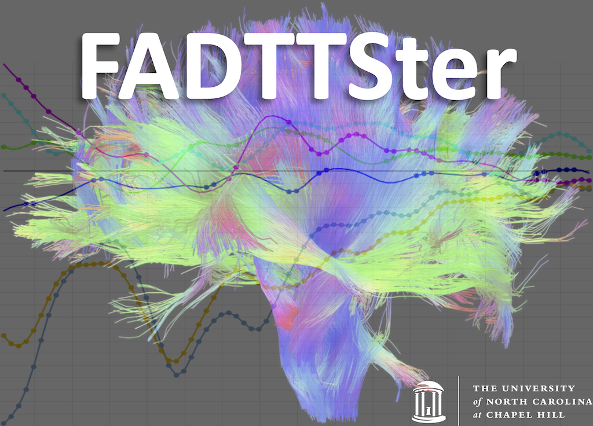

#FADTTSter

write short presentation of the tool

- Matlab script generation:
    * to develope

- Statistical data plotting:
* to develope

##Matlab script generation

### 1. Inputs

### 2. Outputs

##Matlab script generation

### 1. Inputs

### 2. Output visualization

